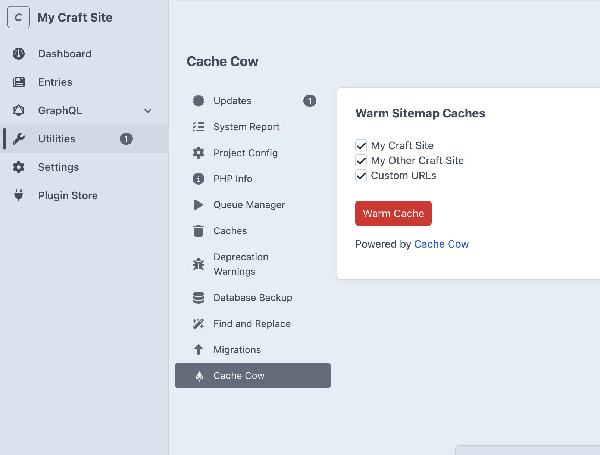
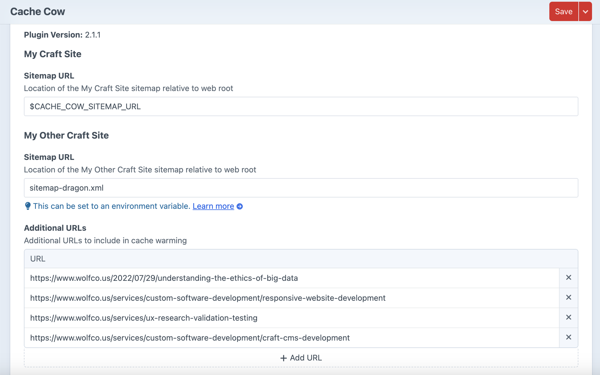
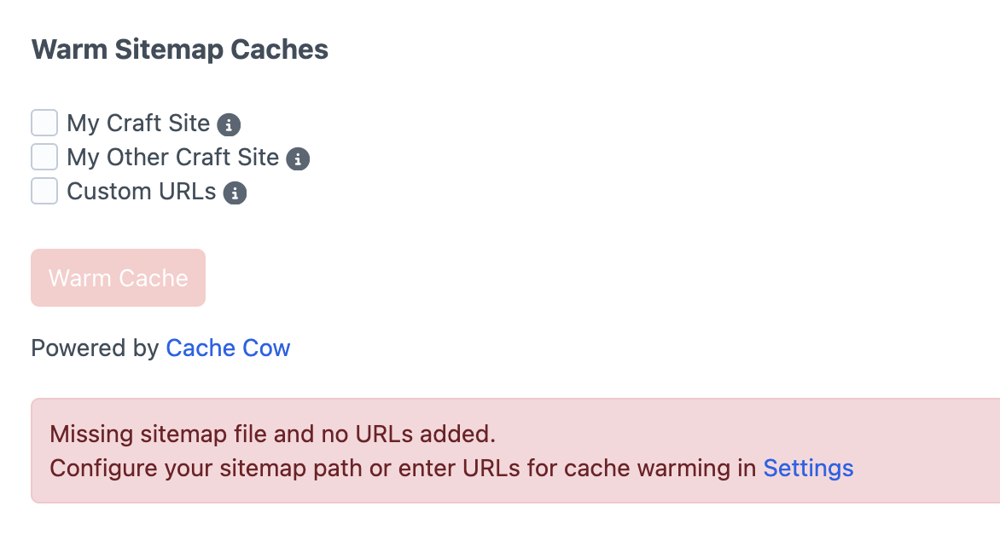

# Cache Cow

This plugin adds a "Warm Cache" button under Utilities > Cache Cow on your Craft CMS control panel. Click it to start the cache warming process on all selected sites.


Cache Cow will look for your sitemap at `{webroot}/sitemap.xml` by default, but you can set the path to your own sitemap in plugin settings. Or you can have the plugin read this value from an environment variable, depending on your needs. Multiple sites are supported.
You can enter additional URLs for cache warming in plugin settings (Settings > Plugins > Cache Cow > Settings).


If no URLs are found for warming (i.e. no sitemap exists at the configured path and no additional URLs have been entered), "Warm Cache" button will be disabled and you'll see an error.


You can also do cache warming via console command
```bash
/path/to/my/craft cache-cow/cache/warm
```
By default it fetches all URLs from all configured sitemaps and any additional URLs added in Settings.
You can target one or a few site handles by passing them in as a comma-separated list
```bash
/path/to/my/craft cache-cow/cache/warm myCraftSite,myOtherCraftSite
```
Use handle `custom` to target additional URLs added in Settings. 


## Requirements

This plugin requires Craft CMS 4.0.0 or later, and PHP 8.2 or later.

## Installation

You can install this plugin from the Plugin Store or with Composer.

#### From the Plugin Store

Go to the Plugin Store in your project’s Control Panel and search for “Cache Cow”. Then press “Install”.

#### With Composer

Open your terminal and run the following commands:

```bash
# go to the project directory
cd /path/to/my-project.test

# tell Composer to load the plugin
composer require wolfco/craft-cache-cow

# tell Craft to install the plugin
/path/to/my/craft plugin/install cache-cow
```

## Run on a schedule using Cron Job (Linux/macOS)

The Cache Cow plugin provides a command to warm the cache: ./craft cache-cow/cache/warm. You can set this command to run on a regular schedule using a cron job.

To run the cache warming command automatically on a regular schedule, follow these steps:

**Step 1: Open the Crontab Editor**

Open a terminal and edit the crontab for the user that runs your web server (usually `www-data` or a specific user on your server):
```bash
crontab -e
```

**Step 2: Add the Cron Job**

Add the following line to the crontab file to run the cache warming command. For example, to run the command every hour:
```bash
0 * * * * /path/to/my/craft cache-cow/cache/warm >/dev/null 2>&1
```
- Replace /path/to/your/craft/installation/ with the actual path to your Craft CMS project.
- The >/dev/null 2>&1 ensures no output is logged unless there's an error.

**Example Cron Job for Daily Execution at Midnight**
To run the cache warming daily at midnight, use this cron job:
```bash
0 0 * * * /path/to/my/craft cache-cow/cache/warm >/dev/null 2>&1
```

> [!NOTE]  
> Steps will vary in a Windows environment


